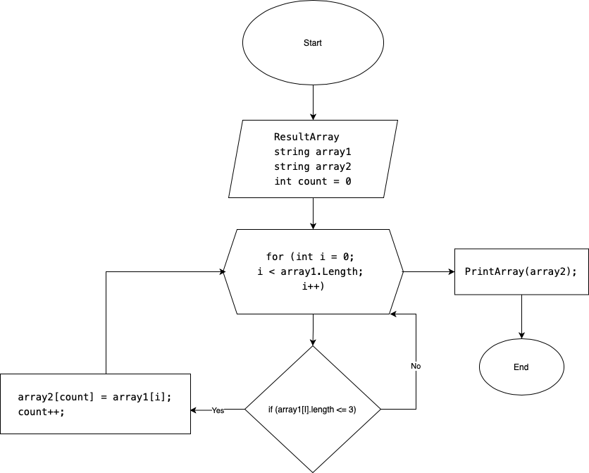

# Итоги блока. Выбор специализации

## Ученик Иванютин Максим Леонидович

### Задачи стоящие перед нами
1. Создать репозиторий
2. Нарисовать блок схему алгоритма
3. Создать файл README с текстовым описанием решения
4. Написать программу на языке программирования С#
5. Создание коммитов

__________________________________________
## Задача: 
Написать программу, которая из имеющегося массива строк формирует массив из строк, длина которых меньше либо равна 3 символа. Первоначальный массив можно ввести с клавиатуры, либо задать на старте выполнения алгоритма. При решение не рекомендуется пользоваться коллекциями, лучше обойтись исключительно массивами.

## Описание программы:
* Для начала создами два массива: изначальный введем с клавиатуры и вторый такой же длины. 
* Потом метод, в котором цикл размером длины массива, внутри цикла будет выполняться проверка условия ( <=3 ), если элемент первого массива подходит под условие, то этот элемент заносится в count элемент второго массива. 
* Переменная count чтобы поочередно закидывать из первого массива во второй и чтобы потом не было пробелов.

## Блок-схема: 

